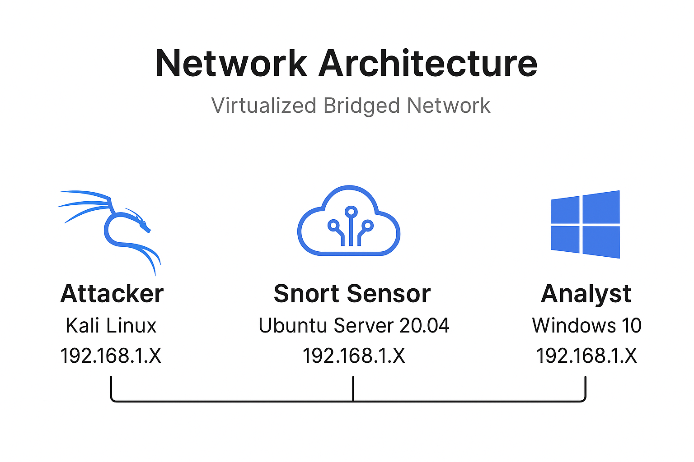
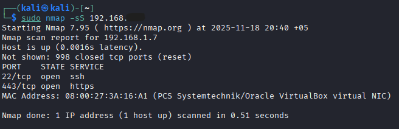
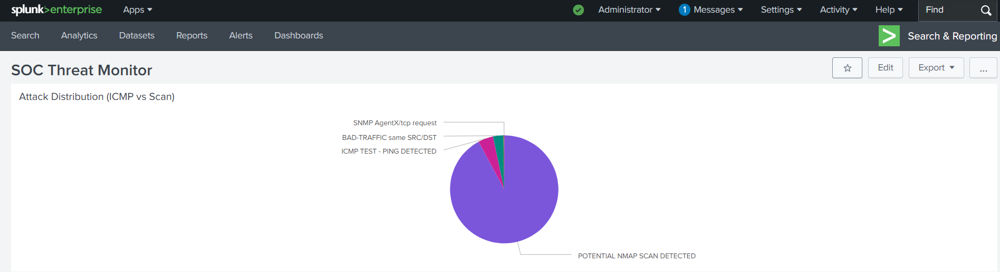

# Automated SOC Threat Dectection Pipeline (Snort ↔ Splunk)


> **Repository Description:** A fully integrated Intrusion Detection System (IDS) and Security Information & Event Management (SIEM) pipeline. Designed to ingest, normalize, and visualize network threats in real-time.

---

## 1. The Scenario
**The Objective:**
In a typical enterprise environment, raw network traffic is noisy and unstructured. Security Analysts cannot review every packet manually. The goal of this project was to build an automated system that filters traffic, identifies malicious patterns (signatures), and presents them on a centralized dashboard for immediate triage.

**The Architecture:**
I designed a three-node environment to simulate a corporate network under siege:
1.  **The Adversary:** A Kali Linux machine launching targeted scanning attacks.
2.  **The Shield:** An Ubuntu Server running Snort 2 in NIDS mode.
3.  **The Brain:** A Windows Analyst Station running Splunk Enterprise.



---

## 2. The Tech Stack & Configuration

### Detection Engine: Snort 2
I chose Snort for its flexibility in signature-based detection. The configuration required moving beyond default settings to recognize specific threat vectors.

* **Network Variables:** Configured `snort.conf` to explicitly define `HOME_NET` (Internal Assets) vs. `EXTERNAL_NET` (The Wild).
* **Signature Development:** I avoided default community rules to write my own from scratch, ensuring I understood the packet structures.

**Key Signatures Deployed (`local.rules`):**

| Signature Type | Rule Logic | Why it matters |
| :--- | :--- | :--- |
| **ICMP Flood** | `alert icmp any any -> $HOME_NET any (msg:"ICMP TEST - PING DETECTED"; sid:1000001; rev:1;)` | Detects reconnaissance pings often used to verify if a host is alive. |
| **TCP SYN Scan** | `alert tcp any any -> $HOME_NET any (msg:"POTENTIAL NMAP SCAN DETECTED"; flags:S; sid:1000002; rev:1;)` | Detects "Half-Open" scans where attackers try to see open ports without completing the handshake. |

### Transport Layer: Splunk Universal Forwarder
The challenge was moving logs from a Linux environment (`/var/log/snort/alert`) to a Windows environment securely.

* **Agent Deployment:** Installed the Splunk Universal Forwarder (UF) on the Ubuntu Sensor.
* **Listener Configuration:** Opened TCP Port **9997** on the Windows Firewall to accept inbound log traffic.
* **Log Monitoring:** configured the forwarder to watch the Snort alert file using the CLI command **add monitor**
   

### Analytics Engine: Splunk Enterprise
Raw logs are useless without parsing. I utilized Splunk's **SPL (Search Processing Language)** to turn text into intelligence.

---

## 3. Execution: The Attack & Defense

### Phase A: The Attack
Using **Kali Linux**, I utilized `Nmap` to launch a stealth scan against the sensor. This specific scan triggers the `flags:S` rule we created.


```
# Executing a Stealth SYN Scan against the target
sudo nmap -sS -v 192.168.1.xxx
```

### Phase B: The Detection

Snort immediately picked up the traffic. The console output confirmed that **Rule SID 1000002** was triggered multiple times.


### Phase C: The Visualization

The logs arrived in Splunk, but the **Threat Name** was buried inside the text message.  
Using **Regular Expressions (Regex)**, I extracted it dynamically.

**The Query**
```bash
source="/var/log/snort/alert" | rex "\] (?<threat_name>[^\[]+) \[\*\*\]" | top threat_name
```

**Technical Note**  
The `rex` command looks for text specifically between the brackets `[* *]` to isolate the human-readable alert name. This extraction pattern targets the message portion Snort places between the `[** ... **]` delimiters so that the `threat_name` field can be created at search time.

---

### Final Dashboard


---

## 4. Troubleshooting

No project goes perfectly. Below are the specific engineering hurdles I encountered and how I resolved them.

### The "Zombie" Process
- **Symptom:** Snort refused to load new rules after editing the config.  
- **Root Cause:** A stale Snort daemon (PID) was still bound to the network interface.  
- **Fix:** Identified the process and terminated it:

```bash
ps aux | grep snort
sudo kill -9 <PID>
sudo systemctl restart snort   # or the appropriate service command
```

### Connectivity

- **Symptom:** Splunk Forwarder could not reach the Indexer.

- **Root Cause:** IPv6 priority issues and/or firewall blocking inbound traffic on port **9997**.

- **Fix:** Forced IPv4 for downloads and verified Windows firewall rules:

```bash
wget -4 <splunk-forwarder-package-url>
# On Windows: confirm inbound rule for TCP 9997 exists and is enabled
```
## 5. Future Roadmap

With the pipeline established, next steps include:

- **Geo-Location:** Enrich IP addresses to visually map attack origins (e.g., MaxMind or Splunk GeoIP).
- **Automated Alerting:** Configure Splunk alert actions to send email or webhook notifications for critical Snort SIDs.
- **Attack Variances:** Expand testing to include UDP floods, application-layer attacks (e.g., SQL injection), and low-and-slow reconnaissance patterns.


